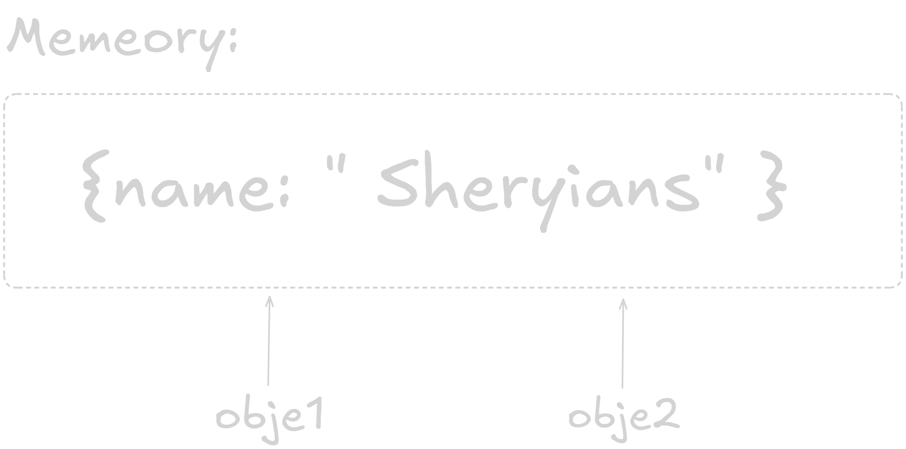

# Javascript Basic Questions

## Introduction to JavaScript

1. Open any website → right-click → Inspect → Console → type: document.title

.png>)

2. Try: alert(“Hello from Sheryians!”)

.png>)
.png>)

3. Write one line in your own words: “If HTML is skeleton, CSS is clothes - what is JS?”

**Ans:** Then JavaScript is the heartbeat that makes it move.

4. Write one example of where you’ve seen JS being used (like popup, animation, etc.)

**Ans:** Menus

## Linking JavaScript Files

1. Create an HTML file and link JS file like this:

2. In app.js, write: console.log(“Connected!”)

.png>)

3. Move the script tag to the section and see what happens.

- When the browser reaches the **script** tag, it pauses HTML parsing to load and run the JavaScript.

- If that JavaScript tries to access elements below the script, you’ll get errors like **“Cannot read property of null.”**

- So, the page might stop rendering properly or the script might not work as expected.

4. Try using defer:

```html
<script defer src="script1.js"></script>
<script defer src="script2.js"></script>
```

**Ans:** The browser starts downloading both script1.js and script2.js while it continues parsing the HTML. The scripts are executed only after the entire HTML document has been parsed (when the DOM is ready). The order of execution follows their order in HTML, first script1.js, then script2.js.

**Without defer**:

HTML parsing stops while script runs, script might run before elements exist and Slower page rendering.

**With defer**

HTML keeps loading, Script runs after DOM is ready and Faster, smoother load.

## Running JS in Browser Console

1. Open console and type: 2 + 2

.png>)

2. Type: alert(“Hi”)

.png>)

3. Try: prompt(“Your name?”)

.png>)
.png>)

4. Type: let city = “Bhopal”; city

.png>)

## Variables and Keywords (var, let, const)

1. Declare your name using all three: var a = “Harsh”; let b = “Sheryians”; const c= “School”.
2. Try reassigning them: a = “Updated”; b = “Updated”; c = “Updated”.

.png>)

**Ans:** const can't reassign, when reassign it throw above TypeError, and in var and let can be reassign.

3. Create a variable inside curly braces using let and log it outside.

**Ans:** It throw an ReferenceError that the num is not defind, Because let is a block scope.

4. Predict output before running.

.png>)

5. Write 3 examples where const is useful (like PI, baseURL, etc.)

**Ans:** API_KEYS, MAX_USERS, Array and Object that developer mostly don't reassign.

## Logging and Interaction (console, alert, prompt)

1. Log name, age, and city using console.log, console.info, console.warn.

.png>)

2. Use prompt to take user’s name → alert a welcome message.

**Ans:** in app.js file

3. Log typeof of user’s input.

**Ans:** It give strig if i write number, boolean and characters.

4. Try: let age = prompt(“Enter age:”); console.log(age + 5); observe what happens.

**Ans** When ever you write any value like string, number or character in "prompt" modal it give only in string, Ex: I gave 22 in prompt and log out "age + 5", it gives me '225' in string.

## Working with Strings

1. let msg = “I love Sheryians”;
2. Try msg.slice(2, 6) and predict the result.

```js
msg.slice(2, 6);

// output
love;
```

3. Try msg.split(” “) and count words.

```js
msg.split(" ");

// output
["I", "love", "Sheryians"];
```

4. Try msg.replace(“love”, “study at”).

```js
msg.replace("love", "study at");

// output
("I study at Sheryians");
```

5. Template string example: let name = “Harsh”; console.log(Hey ${name}, welcome to JS!)

```js
// output
"Hey Harsh, welcome to JS!";
```

6. Check if msg.includes(“love”)

```js
// output
true;
```

## Statements and Semicolons

1. Remove semicolon and check if code still runs.

**Ans:** That will work.

2. Combine two statements in one line and see if it breaks.

```js
const a = 10 const b = 20
console.log(a + b)

// output
Uncaught SyntaxError: Unexpected token 'const'

```

3. Write 3 console.log statements without semicolons and predict output.

```js
console.log("hello");
console.log("from");
console.log("Yugal!");

// output

("hello");
("from");
("Yugal!");
```

## Comments

1. Write your name as a single-line comment.

```js
// single-line comment
```

2. Write a 3-line comment explaining what your code does.

```js
/* This code prints three words in the console
Each console.log displays a message on a new line
It demonstrates how JS runs statements without semicolons */

console.log("Hello");
console.log("from");
console.log("Yugal!");
```

3. Hide one console.log using comment and check output.

```js
console.log("Hello");
// console.log("from")
console.log("Yugal!");

// output

("Hello");
("Yugal!");
```

## Expressions vs Statements

1. Type 5 + 10 (expression).
2. Type let x = 10; (statement).
3. Which one gives a value immediately?

**Ans:** 5+10 will immediately give value 15. let x = 10, it just declares a variable, it performs an action, not a calculation.

```js
// output
15;
```

4. Try: let y = (5 + 10) \* 2; console.log(y)

```js
// output
30;
```

5. Write one line explaining the difference between both.

**Ans:** An expression produces a value, while a statement performs an action but doesn’t return a value immediately.

## Data Types

1. let age = 25; let name = “Harsh”; let isStudent = true; let skills = [“JS”,“HTML”]; let user = { city: “Bhopal” }; let x = null; let y; let z = Symbol(“id”)
2. Log typeof each variable.

```js
let age = 25;
let name = "Harsh";
let isStudent = true;
let skills = ["JS", "HTML"];
let user = { city: "Bhopal" };
let x = null;
let y;
let z = Symbol("id");

// output

number;
string;
boolean;
object;
object;
object;
undefined;
symbol;
```

3. Change one value and recheck typeof.

```js
let age = "25";
console.log(typeof age);

// output
string;
```

4. Try adding a number and string together.

```js
console.log(11 + "hello");

// output
("11hello");
```

## Special Values

1. Log 1 / 0, 0 / 0, Number(“abc”), undefined + 1

```js
console.log(1 / 0);
console.log(0 / 0);
console.log(Number("abc"));
console.log(undefined + 1);
```

2. Write what appears (Infinity, NaN, etc.)

```js
// output
Infinity;
NaN;
NaN;
NaN;
```

3. Write one line explaining when to use null vs undefined.

**Ans:** Use null when you want to intentionally clear or reset a value, and undefined when a variable has been declared but not yet assigned a value.

## Primitive vs Reference

1. let x = 5; let y = x; y = 10; console.log(x, y)

```js
// output
5, 10;
```

2. let obj1 = { name: “Harsh” }; let obj2 = obj1; obj2.name = “Sheryians”;
   console.log(obj1.name)

```js
// output
"Sheryians";
```

3. Observe which one changes together.

**Ans:** obj1 is an object stored in memory. When you write let obj2 = obj1;, you’re not copying the object, you’re just copying the reference to the same object. Both obj1 and obj2 point to the same memory location. Changing a property through obj2 also changes it for obj1.

4. Draw memory boxes on paper to visualize difference.


